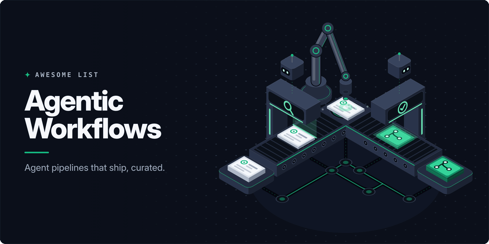

<!-- awesome:hero --><!-- /awesome:hero -->

<!-- awesome:title --><h1 align="center">Awesome Agentic Workflows</h1><!-- /awesome:title -->

<!-- awesome:tagline -->A curated list of AI agents that run inside GitHub: GitHub Agentic Workflows (gh-aw), agent GitHub Actions and issue-to-PR pipelines.<!-- /awesome:tagline -->

<!-- awesome:badges -->

  
  
  

<!-- /awesome:badges -->

GitHub Agentic Workflows describe repository automation in Markdown and run a coding agent in GitHub Actions, with writes gated through safe outputs. This list collects the official resources, ready-made workflows sorted by job, and the tools and agents around them.

## Contents

- [Official Resources](#official-resources)
  - [Project](#project)
  - [Reference Docs](#reference-docs)
- [Workflow Collections](#workflow-collections)
- [Workflows by Job](#workflows-by-job)
  - [Issue Triage and Planning](#issue-triage-and-planning)
  - [Code Review](#code-review)
  - [CI Repair and Testing](#ci-repair-and-testing)
  - [Documentation](#documentation)
  - [Code Improvement](#code-improvement)
  - [Dependencies and Security](#dependencies-and-security)
  - [Releases](#releases)
  - [Reports and Research](#reports-and-research)
  - [Community and Moderation](#community-and-moderation)
  - [Agent Operations](#agent-operations)
  - [Non-Engineering Teams](#non-engineering-teams)
- [Agent GitHub Actions](#agent-github-actions)
- [Issue-Driven Pipelines](#issue-driven-pipelines)
  - [Coding Agents](#coding-agents)
  - [Built on gh-aw](#built-on-gh-aw)
  - [Spec-to-Ship Pipelines](#spec-to-ship-pipelines)
  - [Patterns](#patterns)
- [Tools](#tools)
  - [Runtime and Security](#runtime-and-security)
  - [MCP Servers](#mcp-servers)
  - [Safe Outputs and Shared Imports](#safe-outputs-and-shared-imports)
  - [Authoring](#authoring)
  - [Fleet and Observability](#fleet-and-observability)
- [Guides and Talks](#guides-and-talks)
  - [Guides](#guides)
  - [Articles](#articles)
  - [Workshops](#workshops)
  - [Talks](#talks)
- [Contributing](#contributing)

## Official Resources

### Project

- [Agent Prompt Index](https://github.github.com/gh-aw/llms.txt) - Index of agent-facing prompt files that teach AI tools to write gh-aw workflows.
- [gh-aw](https://github.com/github/gh-aw) - GitHub CLI extension that compiles Markdown agent workflows into Actions YAML.
- [gh-aw Blog](https://github.github.com/gh-aw/blog/) - Project blog with weekly release notes and a series on individual agents.
- [GitHub Agentic Workflows Docs](https://github.github.com/gh-aw/) - Official documentation for writing, running and securing agentic workflows.
- [GitHub Next Project Page](https://githubnext.com/projects/agentic-workflows/) - GitHub Next research page on the ideas behind agentic workflows.

### Reference Docs

- [AI Engines](https://github.github.com/gh-aw/reference/engines/) - Set up Copilot, Claude, Codex, Gemini or Pi as the engine behind a workflow.
- [CLI Commands](https://github.github.com/gh-aw/setup/cli/) - Reference for `gh aw` subcommands such as add, compile, run, logs and audit.
- [Common Issues](https://github.github.com/gh-aw/troubleshooting/common-issues/) - Fixes for frequent compile, permission and runtime errors.
- [Creating Workflows](https://github.github.com/gh-aw/setup/creating-workflows/) - Write a new workflow by hand or with a coding agent, then compile it.
- [FAQ](https://github.github.com/gh-aw/reference/faq/) - Answers on cost, security, engine choice and how gh-aw relates to plain Actions.
- [Frontmatter Reference](https://github.github.com/gh-aw/reference/frontmatter/) - Every field for triggers, permissions, tools, network and engine settings.
- [How They Work](https://github.github.com/gh-aw/introduction/how-they-work/) - Frontmatter, the Markdown prompt body and the compile step to `.lock.yml`.
- [Quick Start](https://github.github.com/gh-aw/setup/quick-start/) - Install the extension, pick an engine and run a first sample workflow.
- [Safe Outputs Reference](https://github.github.com/gh-aw/reference/safe-outputs/) - The validated write operations an agent may request and how to limit them.
- [Security Architecture](https://github.github.com/gh-aw/introduction/architecture/) - Sandboxed read-only agent jobs and the separate jobs that apply writes.
- [Threat Detection](https://github.github.com/gh-aw/reference/threat-detection/) - Scan agent output and patches for injected or harmful content before they apply.

## Workflow Collections

- [Agent Factory Status](https://github.github.com/gh-aw/agent-factory-status/) - Live table of the many workflows the gh-aw team runs on its own repo.
- [Agentic Workflows in Awesome Copilot](https://github.com/github/awesome-copilot/blob/main/docs/README.workflows.md) - Community workflows collected in the awesome-copilot repository.
- [Agentics](https://github.com/githubnext/agentics) - GitHub Next sample pack of maintainer workflows you install with `gh aw add`.
- [Agentics Beyond Code](https://github.com/chrizbo/agentics-beyond-code) - Workflows for product, operations and compliance teams instead of coders.
- [Awesome GitHub Agentic Workflows](https://github.com/OneRose328/awesome-agentic-workflows) - Library of 56 single-purpose templates in seven categories, with a Chinese README.
- [gh-aw Gallery](https://github.github.com/gh-aw/gallery/) - Official examples grouped by task, each with notes on setup and outputs.

## Workflows by Job

### Issue Triage and Planning

- [AI Issue Triage Examples](https://github.github.com/gh-aw/gallery/ai-issue-triage/) - Gallery page on labeling issues, spotting duplicates and asking follow-ups.
- [Archie](https://github.com/githubnext/agentics/blob/main/docs/archie.md) - Draws Mermaid diagrams of how issues and pull requests relate, on `/archie`.
- [Auto Label](https://github.com/OneRose328/awesome-agentic-workflows/blob/main/templates/issue-management/auto-label.md) - Labels new and edited issues with a first set of tags.
- [Auto Triage](https://github.com/OneRose328/awesome-agentic-workflows/blob/main/templates/issue-management/auto-triage.md) - Gives each new issue a priority, a scope and a likely owner.
- [Bug Report Validator](https://github.com/OneRose328/awesome-agentic-workflows/blob/main/templates/issue-management/bug-report-validator.md) - Asks bug reporters for the single most useful detail they left out.
- [Daily Plan](https://github.com/githubnext/agentics/blob/main/workflows/daily-plan.md) - Keeps a planning issue current each day so the team shares one view of work.
- [Discussion Task Miner](https://github.com/githubnext/agentics/blob/main/docs/discussion-task-miner.md) - Turns ideas buried in Discussions into tracked issues.
- [Duplicate Detector](https://github.com/OneRose328/awesome-agentic-workflows/blob/main/templates/issue-management/duplicate-detector.md) - Spots an issue that repeats an earlier one and links the two.
- [Escalation Detector](https://github.com/OneRose328/awesome-agentic-workflows/blob/main/templates/issue-management/escalation-detector.md) - Raises issues that show signs of real urgency above routine ones.
- [Feature Request Analyzer](https://github.com/OneRose328/awesome-agentic-workflows/blob/main/templates/issue-management/feature-request-analyzer.md) - Decides the next step for a feature request from its value and size.
- [First Response](https://github.com/OneRose328/awesome-agentic-workflows/blob/main/templates/issue-management/first-response.md) - Replies to a new issue with a concrete next step and no commitments.
- [Issue Arborist](https://github.com/githubnext/agentics/blob/main/docs/issue-arborist.md) - Links related issues into parent and sub-issue trees.
- [Issue Monster](https://github.com/githubnext/agentics/blob/main/docs/issue-monster.md) - Hands issues with a chosen label to the Copilot coding agent every 30 minutes.
- [Issue Summarizer](https://github.com/OneRose328/awesome-agentic-workflows/blob/main/templates/issue-management/issue-summarizer.md) - Recaps recent issue activity and what is still blocked.
- [Issue Triage](https://github.com/githubnext/agentics/blob/main/docs/issue-triage.md) - Labels incoming issues and pull requests and does little else.
- [Maintaining Repos Example](https://github.github.com/gh-aw/gallery/maintaining-repos/) - Gallery walkthrough of Repo Assist as a recurring maintenance agent.
- [Milestone Assigner](https://github.com/OneRose328/awesome-agentic-workflows/blob/main/templates/issue-management/milestone-assigner.md) - Suggests a milestone for an issue from its size, urgency and release.
- [Plan Command](https://github.com/githubnext/agentics/blob/main/docs/plan.md) - Splits an issue into sub-tasks when a maintainer comments `/plan`.
- [Relevance Check](https://github.com/github/awesome-copilot/blob/main/workflows/relevance-check.md) - Answers `/relevance-check` with a verdict on whether an issue or PR is still needed.
- [Relevance Summary](https://github.com/github/awesome-copilot/blob/main/workflows/relevance-summary.md) - Rolls every relevance check verdict into one summary issue.
- [Repo Assist](https://github.com/githubnext/agentics/blob/main/docs/repo-assist.md) - Scheduled helper that triages, investigates, fixes bugs and reports on activity.
- [Stale Issue Closer](https://github.com/OneRose328/awesome-agentic-workflows/blob/main/templates/issue-management/stale-issue-closer.md) - Spots inactive issues and moves them through a stale-then-close process.
- [Sub-Issue Closer](https://github.com/githubnext/agentics/blob/main/docs/sub-issue-closer.md) - Closes a parent issue once all of its sub-issues are done.

### Code Review

- [Accessibility Checker](https://github.com/OneRose328/awesome-agentic-workflows/blob/main/templates/code-quality/accessibility-checker.md) - Catches accessibility regressions in UI changes, such as keyboard traps.
- [API Consistency Checker](https://github.com/OneRose328/awesome-agentic-workflows/blob/main/templates/code-quality/api-consistency-checker.md) - Checks API changes for broken contracts and mismatched schemas.
- [Architecture Reviewer](https://github.com/OneRose328/awesome-agentic-workflows/blob/main/templates/code-quality/architecture-reviewer.md) - Asks whether a change respects the layering the project already has.
- [Auto Assign Reviewer](https://github.com/OneRose328/awesome-agentic-workflows/blob/main/templates/pr-automation/auto-assign-reviewer.md) - Suggests who should review a pull request first and explains the pick.
- [Automated PR Review Examples](https://github.github.com/gh-aw/gallery/automated-pr-review/) - Gallery page on summary feedback and inline review comments.
- [Breaking Change Detector](https://github.com/OneRose328/awesome-agentic-workflows/blob/main/templates/pr-automation/breaking-change-detector.md) - Warns when a change could break code or users that depend on the project.
- [Code Review Assistant](https://github.com/OneRose328/awesome-agentic-workflows/blob/main/templates/pr-automation/code-review-assistant.md) - Gives a pull request an early review aimed at bugs and risky spots.
- [Complexity Analyzer](https://github.com/OneRose328/awesome-agentic-workflows/blob/main/templates/code-quality/complexity-analyzer.md) - Points to functions whose logic has become hard to follow.
- [Contribution Check](https://github.com/githubnext/agentics/blob/main/docs/contribution-check.md) - Reviews batches of open pull requests against contribution rules on a schedule.
- [Contribution Guidelines Checker](https://github.com/githubnext/agentics/blob/main/docs/contribution-guidelines-checker.md) - Checks a single pull request against the project contribution guide.
- [Error Handling Reviewer](https://github.com/OneRose328/awesome-agentic-workflows/blob/main/templates/code-quality/error-handling-reviewer.md) - Looks at new error paths for swallowed failures and unclear handling.
- [Grumpy Reviewer](https://github.com/githubnext/agentics/blob/main/docs/grumpy-reviewer.md) - On-demand review in the voice of a blunt, exacting senior developer.
- [Merge Conflict Helper](https://github.com/OneRose328/awesome-agentic-workflows/blob/main/templates/pr-automation/merge-conflict-helper.md) - Warns about coming merge conflicts and the files involved.
- [Naming Convention Enforcer](https://github.com/OneRose328/awesome-agentic-workflows/blob/main/templates/code-quality/naming-convention-enforcer.md) - Points out names that break the project's naming style.
- [Performance Analyzer](https://github.com/OneRose328/awesome-agentic-workflows/blob/main/templates/code-quality/performance-analyzer.md) - Spots likely slowdowns and costly new code paths in a change.
- [PR Nitpick Reviewer](https://github.com/githubnext/agentics/blob/main/docs/pr-nitpick-reviewer.md) - On-demand review of style, conventions and small details.
- [PR Size Checker](https://github.com/OneRose328/awesome-agentic-workflows/blob/main/templates/pr-automation/pr-size-checker.md) - Comments when a pull request has grown too big to review well.
- [PR Summary Generator](https://github.com/OneRose328/awesome-agentic-workflows/blob/main/templates/pr-automation/pr-summary-generator.md) - Explains what a pull request changes so reviewers start with context.
- [Tech Debt Identifier](https://github.com/OneRose328/awesome-agentic-workflows/blob/main/templates/code-quality/tech-debt-identifier.md) - Notes the cleanup work a change creates or uncovers.

### CI Repair and Testing

- [CI Coach](https://github.com/githubnext/agentics/blob/main/docs/ci-coach.md) - Suggests changes that make CI workflows faster and cheaper.
- [CI Doctor](https://github.com/githubnext/agentics/blob/main/docs/ci-doctor.md) - Watches CI runs and investigates the cause when one fails.
- [CI Failure Investigation Example](https://github.github.com/gh-aw/gallery/ci-failure-investigation/) - Gallery walkthrough of CI Doctor diagnosing failed runs.
- [Daily Accessibility Review](https://github.com/githubnext/agentics/blob/main/docs/accessibility-review.md) - Runs the app each day and reports accessibility problems it finds.
- [Daily Adhoc QA](https://github.com/githubnext/agentics/blob/main/docs/adhoc-qa.md) - Does exploratory testing of the project and reports what breaks.
- [Daily Test Improver](https://github.com/githubnext/agentics/blob/main/docs/test-improver.md) - Adds tests to the parts of the code with the weakest coverage.
- [PR Fix](https://github.com/githubnext/agentics/blob/main/docs/pr-fix.md) - Investigates failing checks on a pull request and pushes a fix.
- [Setup Validator](https://github.com/OneRose328/awesome-agentic-workflows/blob/main/templates/developer-experience/setup-validator.md) - Confirms the documented setup steps still work on a clean checkout.
- [Test Coverage Reminder](https://github.com/OneRose328/awesome-agentic-workflows/blob/main/templates/pr-automation/test-coverage-reminder.md) - Flags behavior changes that lack tests and names the missing case.

### Documentation

- [Agentic Wiki Coder](https://github.com/githubnext/agentics/blob/main/docs/agentic-wiki-coder.md) - Turns edits made in the GitHub wiki into matching code changes.
- [Agentic Wiki Writer](https://github.com/githubnext/agentics/blob/main/docs/agentic-wiki-writer.md) - Generates GitHub wiki pages from the source and keeps them current.
- [Daily Documentation Updater](https://github.com/githubnext/agentics/blob/main/docs/doc-updater.md) - Daily pass that brings docs in line with recently merged work.
- [Daily Multi-Device Docs Tester](https://github.com/githubnext/agentics/blob/main/docs/multi-device-docs-tester.md) - Tests a docs site on phone, tablet and desktop sizes for layout bugs.
- [Dictation Prompt Generator](https://github.com/githubnext/agentics/blob/main/docs/dictation-prompt.md) - Maintains a `DICTATION.md` vocabulary file for speech-to-text tools.
- [Docs Automation Examples](https://github.github.com/gh-aw/gallery/docs-automation/) - Gallery page on catching docs drift and opening update pull requests.
- [Documentation Checker](https://github.com/OneRose328/awesome-agentic-workflows/blob/main/templates/pr-automation/documentation-checker.md) - Flags user-facing changes that leave the docs out of date.
- [Documentation Unbloat](https://github.com/githubnext/agentics/blob/main/docs/unbloat-docs.md) - Trims wordy documentation while keeping its meaning.
- [Documentation Update on Push](https://github.com/githubnext/agentics/blob/main/docs/update-docs.md) - Refreshes the docs whenever code lands on main.
- [Glossary Maintainer](https://github.com/githubnext/agentics/blob/main/docs/glossary-maintainer.md) - Keeps a project glossary in step with terms used in the code.
- [Link Checker](https://github.com/githubnext/agentics/blob/main/docs/link-checker.md) - Repairs dead links in the documentation on a daily run.
- [Markdown Linter](https://github.com/githubnext/agentics/blob/main/docs/markdown-linter.md) - Lints every Markdown file and files a ranked report of problems.
- [Onboarding Guide](https://github.com/OneRose328/awesome-agentic-workflows/blob/main/templates/developer-experience/onboarding-guide.md) - Writes a newcomer checklist covering setup through a first pull request.
- [Tech Content Editorial Board](https://github.com/githubnext/agentics/blob/main/docs/tech-content-editorial-board.md) - Daily editorial review of technical writing for accuracy and structure.
- [Weekly Comment Sync](https://github.com/github/awesome-copilot/blob/main/workflows/weekly-comment-sync.md) - Brings outdated code comments and README examples back in line through a draft PR.

### Code Improvement

- [Code Improvement Example](https://github.github.com/gh-aw/gallery/code-improvement/) - Gallery walkthrough of Code Simplifier proposing behavior-preserving edits.
- [Code Simplifier](https://github.com/githubnext/agentics/blob/main/docs/code-simplifier.md) - Simplifies recently changed code and opens a pull request.
- [Daily Efficiency Improver](https://github.com/githubnext/agentics/blob/main/docs/efficiency-improver.md) - Looks for ways to make the code use less energy and compute.
- [Daily Perf Improver](https://github.com/githubnext/agentics/blob/main/docs/perf-improver.md) - Benchmarks the code and submits performance improvements.
- [Duplicate Code Detector](https://github.com/githubnext/agentics/blob/main/docs/duplicate-code-detector.md) - Finds repeated code patterns and proposes how to merge them.
- [Large File Simplifier](https://github.com/githubnext/agentics/blob/main/docs/large-file-simplifier.md) - Writes a refactoring plan issue for the biggest file in the codebase.
- [Lean Squad](https://github.com/githubnext/agentics/blob/main/docs/lean-squad.md) - Gradually adds Lean 4 specs and proofs to a codebase to find bugs.
- [Repository Quality Improver](https://github.com/githubnext/agentics/blob/main/docs/repository-quality-improver.md) - Rotates daily through code, docs, tests and security looking for fixes.

### Dependencies and Security

- [CVE Tracker](https://github.com/OneRose328/awesome-agentic-workflows/blob/main/templates/security/cve-tracker.md) - Follows CVEs that touch the project and notes exposure and fixes.
- [Daily Malicious Code Scan](https://github.com/githubnext/agentics/blob/main/docs/malicious-code-scan.md) - Reviews recent commits for backdoors and supply chain tampering.
- [Dependency Analysis Example](https://github.github.com/gh-aw/gallery/dependency-analysis/) - Gallery walkthrough of Go Fan reviewing Go module usage against upstream.
- [Dependency Update Summary](https://github.com/OneRose328/awesome-agentic-workflows/blob/main/templates/release-management/dependency-update-summary.md) - Calls out the dependency bumps in a release that carry real risk.
- [Dependency Vulnerability Alert](https://github.com/OneRose328/awesome-agentic-workflows/blob/main/templates/security/dependency-vulnerability-alert.md) - Reports vulnerable packages and the least risky way to patch them now.
- [Secret Leak Detector](https://github.com/OneRose328/awesome-agentic-workflows/blob/main/templates/security/secret-leak-detector.md) - Looks for API keys, tokens and passwords in diffs and repo files.
- [Security Policy Enforcer](https://github.com/OneRose328/awesome-agentic-workflows/blob/main/templates/security/security-policy-enforcer.md) - Compares security-sensitive changes with the repo's security policy.
- [Security Review Example](https://github.github.com/gh-aw/gallery/security-review/) - Gallery walkthrough of the daily malicious code scan.
- [Security Review Requester](https://github.com/OneRose328/awesome-agentic-workflows/blob/main/templates/security/security-review-requester.md) - Calls in security reviewers only for changes that raise real risk.
- [Security Scan Notifier](https://github.com/OneRose328/awesome-agentic-workflows/blob/main/templates/pr-automation/security-scan-notifier.md) - Explains scanner findings to reviewers and separates real issues from noise.
- [VEX Generator](https://github.com/githubnext/agentics/blob/main/docs/vex-generator.md) - Writes OpenVEX statements for Dependabot alerts that were dismissed.
- [Vulnerability Reporter](https://github.com/OneRose328/awesome-agentic-workflows/blob/main/templates/security/vulnerability-reporter.md) - Gives incoming vulnerability reports a structured first response and next steps.

### Releases

- [Beta Feedback Collector](https://github.com/OneRose328/awesome-agentic-workflows/blob/main/templates/release-management/beta-feedback-collector.md) - Sorts beta tester feedback into must-fix items and recurring themes.
- [Changelog Generator](https://github.com/OneRose328/awesome-agentic-workflows/blob/main/templates/pr-automation/changelog-generator.md) - Writes a changelog line for a pull request, ready for release notes.
- [Hotfix Coordinator](https://github.com/OneRose328/awesome-agentic-workflows/blob/main/templates/release-management/hotfix-coordinator.md) - Steers an urgent fix toward the smallest change that restores production.
- [Migration Guide Generator](https://github.com/OneRose328/awesome-agentic-workflows/blob/main/templates/release-management/migration-guide-generator.md) - Drafts upgrade steps for users when a release breaks compatibility.
- [OSS Release Compliance Checker](https://github.com/github/awesome-copilot/blob/main/workflows/ospo-release-compliance-checker.md) - Checks a repo against open source release requirements and reports gaps.
- [Release Announcement](https://github.com/OneRose328/awesome-agentic-workflows/blob/main/templates/release-management/release-announcement.md) - Writes a release announcement focused on what changes for users.
- [Release Checklist](https://github.com/OneRose328/awesome-agentic-workflows/blob/main/templates/release-management/release-checklist.md) - Lists what is ready, blocked or unknown before a release ships.
- [Release Notes Examples](https://github.github.com/gh-aw/gallery/ai-release-notes/) - Gallery page on generating release notes and release reports.
- [Release Notes Generator](https://github.com/OneRose328/awesome-agentic-workflows/blob/main/templates/release-management/release-notes-generator.md) - Writes release notes from the pull requests merged since the last release.
- [Version Bumper](https://github.com/OneRose328/awesome-agentic-workflows/blob/main/templates/release-management/version-bumper.md) - Picks major, minor or patch for the next release from what changed.

### Reports and Research

- [AgentPages](https://github.com/idorozin/AgentPages) - Template where an agent researches your chosen topics and publishes to Pages.
- [Daily Issues Report](https://github.com/github/awesome-copilot/blob/main/workflows/daily-issues-report.md) - Opens a daily issue that recaps the open backlog and what changed.
- [Daily Repo Status](https://github.com/githubnext/agentics/blob/main/docs/repo-status.md) - Posts a daily read on how the repository is doing.
- [Daily Repository Chronicle](https://github.com/githubnext/agentics/blob/main/docs/repo-chronicle.md) - Tells the day's repository activity as a short news story with charts.
- [Daily Team Status](https://github.com/githubnext/agentics/blob/main/docs/team-status.md) - Summarizes what the team got done, in a friendly tone.
- [Dev Diary](https://github.com/OneRose328/awesome-agentic-workflows/blob/main/templates/developer-experience/dev-diary.md) - Keeps short development notes so recent progress is easy to reconstruct.
- [Metrics and Analytics Example](https://github.github.com/gh-aw/gallery/metrics-analytics/) - Gallery page on recording workflow health and performance data.
- [Multi-Repo Examples](https://github.github.com/gh-aw/gallery/multi-repo/) - Gallery set for cross-repo tracking, feature sync and org-wide updates.
- [OSPO Contributors Report](https://github.com/github/awesome-copilot/blob/main/workflows/ospo-contributors-report.md) - Monthly count of who contributed where across an organization.
- [OSPO Organization Health Report](https://github.com/github/awesome-copilot/blob/main/workflows/ospo-org-health.md) - Weekly org health report on stale work, merge times and contributors.
- [OSPO Stale Repository Report](https://github.com/github/awesome-copilot/blob/main/workflows/ospo-stale-repos.md) - Lists quiet repositories in an org with a case for archiving each.
- [Repo Ask](https://github.com/githubnext/agentics/blob/main/docs/repo-ask.md) - Answers research questions about the repository when asked in a comment.
- [Retrospective Helper](https://github.com/OneRose328/awesome-agentic-workflows/blob/main/templates/developer-experience/retrospective-helper.md) - Drafts a retrospective with wins, pain points and follow-ups.
- [Sprint Planner](https://github.com/OneRose328/awesome-agentic-workflows/blob/main/templates/developer-experience/sprint-planner.md) - Drafts a realistic sprint scope from the backlog and dependencies.
- [Standup Generator](https://github.com/OneRose328/awesome-agentic-workflows/blob/main/templates/developer-experience/standup-generator.md) - Drafts a standup update listing what moved and what is stuck.
- [Weekly Issue Activity](https://github.com/githubnext/agentics/blob/main/docs/weekly-issue-activity.md) - Charts how issue counts moved this week and suggests next steps.
- [Weekly Repository Map](https://github.com/githubnext/agentics/blob/main/docs/weekly-repo-map.md) - Draws an ASCII tree map of the repository file layout and sizes.
- [Weekly Research](https://github.com/githubnext/agentics/blob/main/docs/weekly-research.md) - Gathers research news and industry trends relevant to the project.

### Community and Moderation

- [AI Moderator](https://github.com/githubnext/agentics/blob/main/docs/ai-moderator.md) - Moderates spam, link drops and AI-written filler in issues and comments.
- [Community Health Report](https://github.com/OneRose328/awesome-agentic-workflows/blob/main/templates/community/community-health-report.md) - Reports response times, contribution flow and support load.
- [Contributor Recognition](https://github.com/OneRose328/awesome-agentic-workflows/blob/main/templates/community/contributor-recognition.md) - Writes thank-you notes that name what each contributor did.
- [Discussion Moderator](https://github.com/OneRose328/awesome-agentic-workflows/blob/main/templates/community/discussion-moderator.md) - Moderates or reroutes a Discussion only when it needs it.
- [FAQ Responder](https://github.com/OneRose328/awesome-agentic-workflows/blob/main/templates/community/faq-responder.md) - Replies to common questions with stock answers and stays out of unclear ones.
- [Good First Issue Tagger](https://github.com/OneRose328/awesome-agentic-workflows/blob/main/templates/community/good-first-issue-tagger.md) - Labels issues that a newcomer could finish without deep context.
- [Hacktoberfest Manager](https://github.com/OneRose328/awesome-agentic-workflows/blob/main/templates/community/hacktoberfest-manager.md) - Gets a set of issues ready for Hacktoberfest-style contribution drives.
- [New Contributor Welcome](https://github.com/OneRose328/awesome-agentic-workflows/blob/main/templates/community/new-contributor-welcome.md) - Says hello to first-time contributors and points them to the basics.
- [Roadmap Updater](https://github.com/OneRose328/awesome-agentic-workflows/blob/main/templates/community/roadmap-updater.md) - Collects issue and discussion signals that should shape the roadmap.

### Agent Operations

- [Cost Tracker](https://github.com/githubnext/agentics/blob/main/docs/cost-tracker.md) - Posts the token spend of each agent run on its pull request.
- [Log Watcher](https://github.com/AgentMeter/agentmeter-action/blob/main/workflows/log-watcher.md) - Scans agent run logs for errors, retry loops and token spikes.
- [Q Workflow Optimizer](https://github.com/githubnext/agentics/blob/main/docs/q.md) - Reviews your other agentic workflows and suggests improvements.

### Non-Engineering Teams

- [Adversarial PM](https://github.com/chrizbo/agentics-beyond-code/blob/main/.github/workflows/adversarial-pm.md) - Argues each week against the team's biggest decisions to test them.
- [Compliance Review](https://github.com/chrizbo/agentics-beyond-code/blob/main/.github/workflows/compliance-review.md) - Scores work against security, privacy, accessibility and AI rubrics.
- [Decision Log](https://github.com/chrizbo/agentics-beyond-code/blob/main/.github/workflows/decision-log.md) - Captures decisions found in comments and transcripts as structured records.
- [GTM Content](https://github.com/chrizbo/agentics-beyond-code/blob/main/.github/workflows/gtm-content.md) - Drafts changelog entries and roadmap items in the house voice.
- [Launch Readiness Checker](https://github.com/chrizbo/agentics-beyond-code/blob/main/.github/workflows/launch-readiness.md) - Monday check on every launch: what is missing, risky or awaiting sign-off.
- [Leadership Briefs](https://github.com/chrizbo/agentics-beyond-code/blob/main/.github/workflows/leadership-brief.md) - Writes a tailored Monday briefing for each leader.
- [Process Analyzer](https://github.com/chrizbo/agentics-beyond-code/blob/main/.github/workflows/process-analyzer.md) - Compares meeting transcripts with process docs and proposes doc updates.
- [Weekly Status](https://github.com/chrizbo/agentics-beyond-code/blob/main/.github/workflows/weekly-status.md) - End-of-week summary of what shipped, what was learned and what needs help.

## Agent GitHub Actions

- [AI Inference](https://github.com/actions/ai-inference) - Official action that sends a prompt to GitHub Models and returns the reply.
- [Augment Agent](https://github.com/augmentcode/augment-agent) - Runs the Auggie CLI in a workflow for reviews and repository tasks.
- [Claude Code Action](https://github.com/anthropics/claude-code-action) - Runs Claude Code on `@claude` mentions, reviews and automation jobs.
- [Claude Code Security Review](https://github.com/anthropics/claude-code-security-review) - Action where Claude reviews pull request diffs for security flaws.
- [Codex Action](https://github.com/openai/codex-action) - Runs the OpenAI Codex CLI inside a job with a scoped API key.
- [Cursor CLI in GitHub Actions](https://cursor.com/docs/cli/github-actions) - Cursor guide to running its CLI agent in workflows.
- [Docker Agent Action](https://github.com/docker/docker-agent-action) - Runs Docker Agent definitions as a step in a workflow.
- [Droid Action](https://github.com/Factory-AI/droid-action) - Runs the Factory Droid agent on pull requests and comment mentions.
- [OpenCode GitHub Agent](https://opencode.ai/docs/github/) - Answers `/opencode` comments on issues and pull requests from Actions.
- [Oz Agent Action](https://github.com/warpdotdev/oz-agent-action) - Runs the Warp Oz coding agent inside a GitHub Actions job.
- [Pi Coding Agent Action](https://github.com/shaftoe/pi-coding-agent-action) - Connects the pi coding agent to issues, pull requests and CI.
- [PR-Agent](https://github.com/The-PR-Agent/pr-agent) - Open source pull request reviewer that runs as an action or app.
- [Qwen Code Action](https://github.com/QwenLM/qwen-code-action) - Runs the Qwen Code agent from a workflow for reviews and repo tasks.
- [Run Gemini CLI](https://github.com/google-github-actions/run-gemini-cli) - Runs Gemini CLI in Actions, with sample triage, review and fix workflows.

## Issue-Driven Pipelines

### Coding Agents

- [Codex Cloud](https://developers.openai.com/codex/cloud) - Hosted Codex that takes tasks, including from GitHub, and returns pull requests.
- [Copilot Coding Agent](https://docs.github.com/en/copilot/concepts/agents/coding-agent/about-coding-agent) - GitHub agent that takes an assigned issue, works in Actions and opens a PR.
- [Jules](https://jules.google) - Google asynchronous coding agent that works on GitHub repos and opens PRs.
- [OpenHands](https://github.com/OpenHands/OpenHands) - Open source software agent with a GitHub resolver for labeled issues.
- [Orbi](https://github.com/orbi-build/orbi) - Self-hosted runner that takes labeled issues to reviewed PRs, merges them and cuts tagged releases.
- [Patchwork](https://github.com/patched-codes/patchwork) - Patchflows that fix, review and document code and then open pull requests.
- [SWE-agent](https://github.com/SWE-agent/SWE-agent) - Research agent that takes a GitHub issue and tries to fix it with any model.

### Built on gh-aw

- [Autoloop](https://github.com/githubnext/autoloop) - Repeats a task from an issue on a schedule and keeps only measured gains.
- [Crane](https://github.com/githubnext/crane) - Plans and runs a code migration between languages, piece by piece.
- [Goal](https://github.com/githubnext/goal) - Works a goal issue across many runs on one long-lived branch and PR.

### Spec-to-Ship Pipelines

- [CCPM](https://github.com/automazeio/ccpm) - Claude Code project management that turns specs into issues and worktree agents.
- [workkit](https://github.com/ITW-Creative-Works/workkit) - Claude Code plugin that runs GitHub Issues as a spec-to-ship agent pipeline.

### Patterns

- [ChatOps](https://github.github.com/gh-aw/patterns/chat-ops/) - Slash commands in issues and pull requests that start agent work.
- [Feature Grower](https://github.github.com/gh-aw/patterns/feature-grower/) - Grows a long feature by opening one ready-to-build sub-issue at a time.
- [IssueOps](https://github.github.com/gh-aw/patterns/issue-ops/) - Workflows that triage and answer issues as they are opened.
- [LabelOps](https://github.github.com/gh-aw/patterns/label-ops/) - Agent work that starts when a given label is added or removed.
- [OrchestratorOps](https://github.github.com/gh-aw/patterns/orchestrator-ops/) - One workflow decides the work and dispatches worker workflows to do it.
- [ProjectOps](https://github.github.com/gh-aw/patterns/project-ops/) - Agents that route items and update fields on GitHub Projects boards.
- [ResearchPlanAssignOps](https://github.github.com/gh-aw/patterns/research-plan-assign-ops/) - Research, then plan into issues, then assign to a coding agent to merge.
- [WorkQueueOps](https://github.github.com/gh-aw/patterns/workqueue-ops/) - Works through a queue kept in issues, sub-issues or Discussions.

## Tools

### Runtime and Security

- [gh-aw Actions](https://github.com/github/gh-aw-actions) - Shared actions that compiled agentic workflows call at run time.
- [gh-aw Firewall](https://github.com/github/gh-aw-firewall) - Egress firewall that limits which domains an agent container can reach.
- [gh-aw Threat Detection](https://github.com/github/gh-aw-threat-detection) - Checks agent output for prompt injection, leaked secrets and bad patches.

### MCP Servers

- [arXiv Import](https://github.com/githubnext/agentics/blob/main/workflows/shared/arxiv.md) - Shared import that lets an agent search arXiv and fetch papers.
- [gh-aw as an MCP Server](https://github.github.com/gh-aw/reference/gh-aw-as-mcp-server/) - Exposes `gh aw` commands such as compile, logs and audit as MCP tools.
- [gh-aw MCP Gateway](https://github.com/github/gh-aw-mcpg) - Gateway that routes and filters the MCP tool calls an agent run makes.
- [GitHub MCP Server](https://github.com/github/github-mcp-server) - GitHub server giving agents tools for issues, PRs, code and Actions.
- [MarkItDown Import](https://github.com/githubnext/agentics/blob/main/workflows/shared/markitdown.md) - Shared import that converts PDFs, Office files and HTML to Markdown.
- [Microsoft Docs Import](https://github.com/githubnext/agentics/blob/main/workflows/shared/mcp/microsoft-docs.md) - Shared import that connects an agent to Microsoft Learn documentation.
- [Repo Mind Light Workflow](https://github.com/githubnext/repo-mind-light-aw) - Shared workflow that indexes a repo and starts the Repo Mind Light server.

### Safe Outputs and Shared Imports

- [Calendar Safe Outputs](https://github.com/chrizbo/agentics-beyond-code/blob/main/.github/workflows/shared/calendar-safe-outputs.md) - Shared import that adds a gated safe output for calendar events.
- [Custom Safe Outputs](https://github.github.com/gh-aw/reference/custom-safe-outputs/) - How to add your own validated write jobs for third-party services.
- [FFmpeg Import](https://github.com/githubnext/agentics/blob/main/workflows/shared/ffmpeg.md) - Shared import that installs FFmpeg for audio and video processing.
- [Formatting Import](https://github.com/githubnext/agentics/blob/main/workflows/shared/formatting.md) - Shared import with a standard layout of overview and folded details.
- [Freshness Check Import](https://github.com/chrizbo/agentics-beyond-code/blob/main/.github/workflows/shared/freshness-check.md) - Shared import that checks whether source data is recent enough to use.
- [Reporting Import](https://github.com/githubnext/agentics/blob/main/workflows/shared/reporting.md) - Shared import with rules for linking run IDs in workflow reports.
- [Safe Outputs Samples](https://github.github.com/gh-aw/experimental/safe-outputs-samples/) - Replays fixed safe-output payloads in place of the agent for tests.
- [Slack Safe Outputs](https://github.com/chrizbo/agentics-beyond-code/blob/main/.github/workflows/shared/slack-safe-outputs.md) - Shared import that adds a gated safe output for posting to Slack.
- [sq Import](https://github.com/githubnext/agentics/blob/main/workflows/shared/sq.md) - Shared import that installs `sq` to query CSV, Excel, JSON and SQL data.

### Authoring

- [gh-aw Editor Visualizer](https://github.com/Mossaka/gh-aw-editor-visualizer) - Visual editor for building gh-aw workflows without writing frontmatter.
- [gh-aw Inspector](https://github.com/petermefrandsen/gh-aw-inspector) - VS Code extension to inspect, simulate and document gh-aw workflows.
- [gh-aw Wizard](https://github.com/githubnext/gh-aw-wizard) - Question-driven web tool from GitHub Next that writes a workflow file.
- [GitHub Agent Runner](https://github.com/verkyyi/github-agent-runner) - Claude Code plugin that finds gh-aw workflows and installs them in a repo.
- [GitHub Agentic Workflows Plugin](https://github.com/zircote-plugins/github-agentic-workflows) - Claude Code plugin to write, compile-check and improve gh-aw workflows.

### Fleet and Observability

- [AgentMeter Action](https://github.com/AgentMeter/agentmeter-action) - Tracks token use and cost of agent runs and reports it per pull request.
- [Central Agentic Ops](https://github.com/githubnext/gh-aw-cao) - Control repository that runs agentic operations across a fleet of repos.
- [gh-aw Fleet](https://github.com/rshade/gh-aw-fleet) - Declarative tool that keeps gh-aw installs in sync across many repos.

## Guides and Talks

### Guides

- [Claude Code GitHub Actions](https://code.claude.com/docs/en/github-actions) - Anthropic guide to setting up and configuring Claude Code in workflows.
- [Codex GitHub Action Guide](https://developers.openai.com/codex/github-action) - OpenAI guide to running Codex in CI with the official action.
- [Copilot Coding Agent How-To](https://docs.github.com/en/copilot/how-tos/use-copilot-agents/coding-agent) - GitHub docs on assigning issues to Copilot and steering its pull requests.
- [GitHub Actions Primer](https://github.github.com/gh-aw/guides/github-actions-primer/) - Actions basics for newcomers, compared with agentic workflows.
- [Measuring Impact](https://github.github.com/gh-aw/practices/measuring-impact/) - Track cost, outcomes and trends to judge whether a workflow pays off.
- [Safe Rollout](https://github.github.com/gh-aw/practices/safe-rollout/) - Move a workflow from report-only to real writes in measured steps.
- [Sharing Workflows](https://github.github.com/gh-aw/practices/sharing-workflows/) - Reuse and govern workflows across repositories and organizations.
- [Using at Scale](https://github.github.com/gh-aw/guides/using-at-scale/) - Advice for adopting and governing agentic workflows across many teams.
- [Using MCP Servers](https://github.github.com/gh-aw/guides/mcps/) - Connect workflow agents to GitHub, databases and outside services over MCP.

### Articles

- [Agentic Workflows No Longer Need a PAT](https://github.blog/changelog/2026-06-11-agentic-workflows-no-longer-need-a-personal-access-token) - Changelog note on running workflows with the built-in `GITHUB_TOKEN`.
- [Automate Repository Tasks with GitHub Agentic Workflows](https://github.blog/ai-and-ml/automate-repository-tasks-with-github-agentic-workflows/) - GitHub blog introduction to agents in Actions for triage, docs and quality.
- [Automating Cross-Repo Documentation](https://github.blog/ai-and-ml/github-copilot/automating-cross-repo-documentation-with-github-agentic-workflows/) - How the Aspire team turns merged changes into reviewed docs pull requests.
- [Copilot Coding Agent 101](https://github.blog/ai-and-ml/github-copilot/github-copilot-coding-agent-101-getting-started-with-agentic-workflows-on-github/) - Getting started with handing issues to the Copilot coding agent.
- [Custom Linters from Three Workflows](https://github.github.com/gh-aw/blog/2026-06-26-custom-linters-sergo-linter-miner-and-lintmonster/) - How gh-aw mines, audits and applies its own Go lint rules with agents.
- [From Idea to PR](https://github.blog/ai-and-ml/github-copilot/from-idea-to-pr-a-guide-to-github-copilots-agentic-workflows/) - Walkthrough of turning an issue into a tested pull request with Copilot.
- [GitHub Agentic Workflows Public Preview](https://github.blog/changelog/2026-06-11-github-agentic-workflows-is-now-in-public-preview) - Changelog post opening the public preview in June 2026.
- [GitHub Agentic Workflows Technical Preview](https://github.blog/changelog/2026-02-13-github-agentic-workflows-are-now-in-technical-preview) - Changelog post that opened the technical preview in February 2026.
- [Improving Token Efficiency](https://github.blog/ai-and-ml/github-copilot/improving-token-efficiency-in-github-agentic-workflows/) - How the team found wasted tokens in per-PR agents and cut the bill.
- [Introducing Gemini CLI GitHub Actions](https://blog.google/technology/developers/introducing-gemini-cli-github-actions/) - Google launch post for running Gemini CLI as a repository teammate.
- [Meet the Workflows](https://github.github.com/gh-aw/blog/2026-01-13-meet-the-workflows/) - Guided tour of the triage and summary agents in the gh-aw factory.
- [Security Architecture of GitHub Agentic Workflows](https://github.blog/ai-and-ml/generative-ai/under-the-hood-security-architecture-of-github-agentic-workflows/) - The threat model and layers that let agents run safely in Actions.
- [Welcome to Peli's Agent Factory](https://github.github.com/gh-aw/blog/2026-01-12-welcome-to-pelis-agent-factory/) - Opening post of a series on the agents the gh-aw team runs daily.

### Workshops

- [Factory Tour Workshop](https://github.com/githubnext/gh-aw-workshop) - Official step-by-step workshop for building and running your first workflows.
- [Hire an AI Teammate](https://github.com/evgenijrenke/workshop-agentic-workflows-wad2026) - Hands-on gh-aw workshop from WeAreDevelopers 2026.
- [Zava Skills Workshop](https://github.com/DevExpGbb/zava-skills-workshop-template) - Template where you build an agent skill and ship it with `gh aw`.

### Talks

- [Automate Your Repo with GitHub Agentic Workflows](https://www.youtube.com/watch?v=XH8oKA-ZYbU) - GitHub video showing agentic workflows handling routine repo work.
- [GitHub Agentic Workflows - Peli de Halleux](https://www.youtube.com/watch?v=kR5p-aVoriA) - Global AI Community talk by one of the gh-aw creators.
- [GitHub Agentic Workflows Explained](https://www.youtube.com/watch?v=T2W0nIEQIgc) - Don Syme of GitHub Next explains the design and the safety model.
- [GitHub Agentic Workflows: Automation That Actually Reads the Room](https://www.youtube.com/watch?v=0XTyicuhdKE) - Microsoft Developer session with live demos of event-driven agents.
- [How the GitHub Copilot Coding Agent Works](https://www.youtube.com/watch?v=1GVBRhDI5No) - GitHub Checkout episode on how the coding agent turns issues into PRs.
- [How to Use Agentic Workflows for Your Repos](https://www.youtube.com/watch?v=XisVQoz5grw) - GitHub Checkout episode on setting up a first agentic workflow.
- [Introducing GitHub Agentic Workflows](https://www.youtube.com/watch?v=3_i03fGXs9U) - GitHub launch video on intent-driven repository automation.
- [Introducing GitHub Agentic Workflows: AI That Runs Your Repo](https://www.youtube.com/watch?v=W4oAJgZx7-U) - Microsoft Research talk on the research behind the project.
- [Jira Ticket to GitHub Pull Request](https://www.youtube.com/watch?v=kaIz0X_YByE) - Mickey Gousset wires custom Copilot agents and workflows from ticket to PR.
- [Rubber Duck Thursdays: GitHub Agentic Workflows](https://www.youtube.com/watch?v=Dw2S-VQDvhs) - GitHub live stream that builds and discusses agentic workflows.

## Contributing

Contributions are welcome. Read the [contribution guidelines](contributing.md) first.

<!-- awesome:maintainer -->
Maintained by [Ian Wiedenman](https://github.com/ianwieds).
<!-- /awesome:maintainer -->
